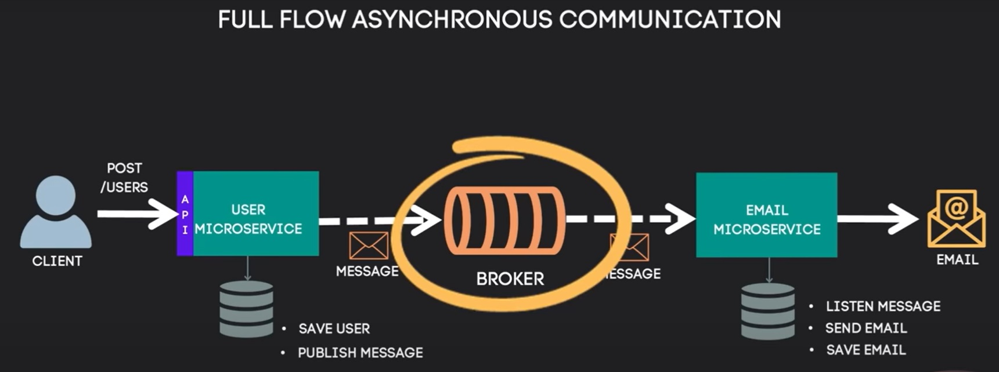

# Asynchronous Communication Between Microservices Using RabbitMQ

## Project Description
This project demonstrates the asynchronous communication flow between two microservices using RabbitMQ as a message broker. The scenario involves registering a new user and sending a confirmation email.

## Project Flow
1. A client sends a POST request to register a new user in the system.
2. Once the "User Microservice" receives the new user:
   - 2.1 It saves the user in the database (the "User Microservice" is responsible for managing users in the system).
   - 2.2 Then, it produces a message to the Broker to handle asynchronous communication.
3. The Broker (RabbitMQ) receives the message.
4. The "Email Microservice," which is connected to this Broker:
   - 4.1 Consumes the message.
   - 4.2 Sends a "Registration Successful" confirmation email.
   - 4.3 Finally, it saves the email record in the database.

1. **Client Request:** The client sends a POST request to the "User Microservice" to register a new user.
2. **User Microservice:** Receives the request, saves the user information in the PostgreSQL database, and sends a message to RabbitMQ.
3. **RabbitMQ Broker:** Receives and holds the message for processing.
4. **Email Microservice:** Consumes the message from RabbitMQ, sends a confirmation email to the new user, and logs the email in the database.

This flow enables asynchronous communication, ensuring decoupling between the microservices for improved scalability and fault tolerance.

## Technologies Used

1. **Java (version 17)**: Core programming language used to build the microservices.
2. **Maven**: Dependency management tool used to handle project libraries and build the project.
3. **Lombok**: Automates code generation for getters, setters, constructors, and other boilerplate code.
4. **Spring Ecosystem**:
   - **Spring Boot**: To bootstrap and run the business microservices.
   - **Spring Web**: To create RESTful endpoints.
   - **Spring Data JPA**: To interact with the database and handle transactions.
   - **Spring Validation**: To validate API inputs.
   - **Spring AMQP**: To work with messaging protocols for asynchronous processing.
   - **Spring Mail**: To send confirmation emails to users.
5. **PostgreSQL**: The relational database used to store user and email information.
6. **RabbitMQ**: Message broker used for asynchronous communication (hosted on Cloud AMQP).
7. **Cloud AMQP**: RabbitMQ hosted in the cloud to manage message queues.
8. **SMTP (Google Mail)**: SMTP server used to send confirmation emails.

## Full Flow of Asynchronous Communication

